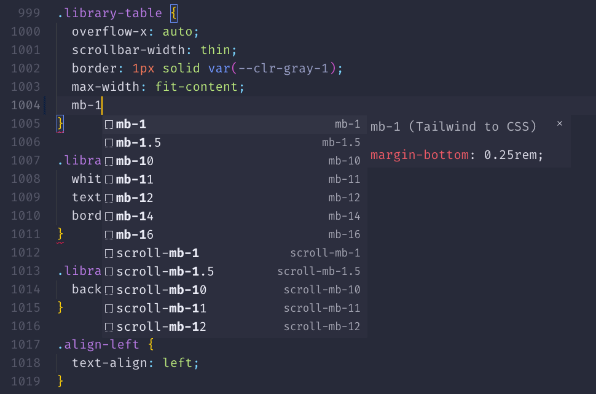
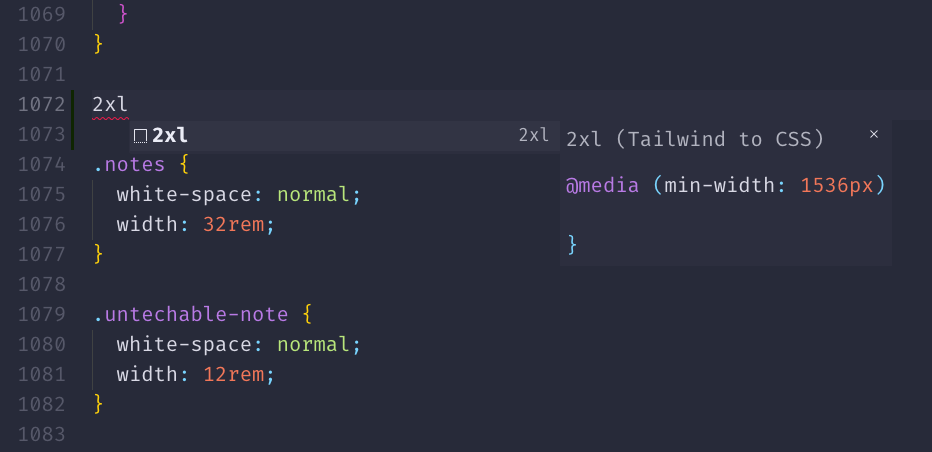

# Tailwind to CSS Snippets

Tailwind to CSS Snippets allows users to type the Tailwind classes they know, and output CSS properties and at-rules for use in traditional CSS files.

## Installation

**[Install via the Visual Studio Code Marketplace →]()**

## Features

Tailwind class names serve as shorthand snippets for the CSS properties they apply.



Access media queries for responsive and accessible design, and other Tailwind at-rule classes.



### Support

`CSS`, `SCSS`, and `Less` are currently supported.

## Recommended VS Code Settings

It is recommended to set `Snippet Suggestions` to `inline (default)` or `top`, otherwise snippets will be hidden or below all other suggestions.

## Troubleshooting

If you use the [Tailwind CSS IntelliSense](https://marketplace.visualstudio.com/items?itemName=bradlc.vscode-tailwindcss) VS Code plugin, you may have the following CSS file association set, as recommended by its documentation:
```
"files.associations": {
  "*.css": "tailwindcss"
}
```
**Remove this association** for Tailwind to CSS code snippets to be properly enabled in `.css` files.
